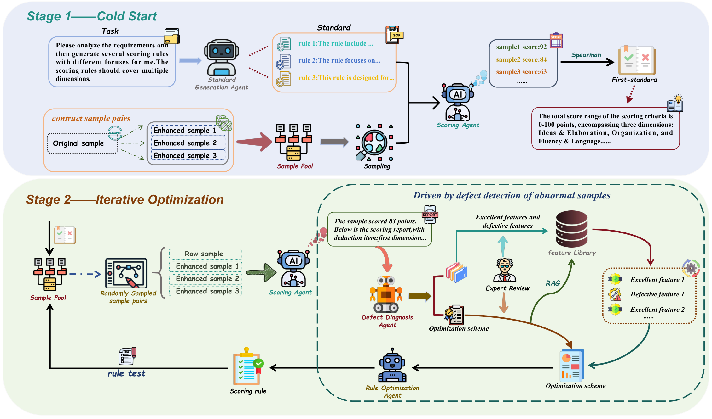

# DD-MARI: Defect-Driven Multi-Agent Rule Induction
# DD-MARI：缺陷驱动的多智能体规则归纳框架

[](https://arxiv.org/)
[](https://www.python.org/)
[](LICENSE)

Official implementation of the paper:

> **Beyond Black-Box Scoring: An Interpretable and Defect-Driven Few-Shot Rule Induction Framework for Document Quality Assessment**
> *Haibo Zhu*

本文的官方代码实现：

> **超越黑箱评分：一种可解释的缺陷驱动少样本规则归纳框架用于文档质量评估**
> *朱海波*

---



---

## Overview / 概述

DD-MARI addresses three black-box problems in automated Document Quality Assessment (DQA):

DD-MARI 解决了自动化文档质量评估（DQA）中的三个黑箱问题：

| Problem / 问题 | Source / 来源 | DD-MARI Solution / DD-MARI 解决方案 |
|---|---|---|
| **Parameter Black-Box** / **参数黑箱** | End-to-end neural models / 端到端神经模型 | Explicit natural-language scoring rules / 显式自然语言评分规则 |
| **Logical Black-Box** / **逻辑黑箱** | Naive LLM self-refinement / 朴素 LLM 自我优化 | Defect-driven multi-agent optimization / 缺陷驱动多智能体优化 |
| **Cognitive Black-Box** / **认知黑箱** | Human–AI psychometric misalignment / 人机心理测量失配 | Double-blind arbitration + nonlinear calibration / 双盲仲裁 + 非线性校准 |

The framework achieves **QWK = 0.7332** on the ASAP Set 1 benchmark using only **40 training samples** — less than 4% of the data required by supervised baselines — while providing full interpretability.

该框架仅使用 **40 个训练样本**（不足监督基线所需数据的 4%）即在 ASAP Set 1 基准上达到 **QWK = 0.7332**，同时提供完整的可解释性。

---

## Framework Architecture / 框架架构

```
┌─────────────────────────────────────────────────────────────────┐
│                    DD-MARI Pipeline                             │
│                                                                 │
│  Phase 2: Cold Start          Phase 3: Iterative Optimization  │
│  阶段2：冷启动                  阶段3：迭代优化                    │
│  ┌──────────────────┐         ┌──────────────────────────────┐ │
│  │ Standard         │         │ Defect      Feature          │ │
│  │ Generation  ───► │ R₀      │ Diagnosis ──Library (RAG)    │ │
│  │ Agent (SGA) │    │ ──────► │ Agent       ▼                │ │
│  │ 标准生成智能体│    │         │ (DDA)   Rule Optimization    │ │
│  └─────────────┘    │         │ 缺陷诊断    Agent (ROA)       │ │
│  Spearman-guided    │         │ 智能体      规则优化智能体      │ │
│  selection          │         │                 ▼            │ │
│  Spearman引导选择    │         │ Scoring Agent (SA) + Rollback│ │
│                     │         │ 评分智能体 + 回滚机制           │ │
│                     │         └──────────────────────────────┘ │
│                                                                 │
│  Phase 4: Cognitive-Aligned Execution (subjective tasks)       │
│  阶段4：认知对齐执行（主观任务）                                    │
│  ┌────────────────────────────────────────────────────────┐    │
│  │ Agent A (length-sensitive) ──┐                         │    │
│  │ 智能体A（长度敏感）             ├─► N = |Sₐ−S_b|         │    │
│  │ Agent B (desensitized)   ────┘   长度依赖指数 ↓          │    │
│  │ 智能体B（脱敏）                   Verbosity Filter        │    │
│  │                                  冗余过滤                 │    │
│  │                                        ↓                │    │
│  │                              Nonlinear Calibration      │    │
│  │                              非线性校准                   │    │
│  │                              f(s) = s + κΣ(·)^αᵢ        │    │
│  └────────────────────────────────────────────────────────┘    │
└─────────────────────────────────────────────────────────────────┘
```

---

## Quick Start / 快速开始

### 1. Clone and Install / 克隆与安装

```bash
git clone https://github.com/your-username/DD-MARI.git
cd DD-MARI
pip install -r requirements.txt
```

### 2. Configure API Key / 配置 API 密钥

```bash
cp .env.example .env
# Edit .env and set your LLM API key
# 编辑 .env 文件，填入你的 LLM API 密钥
```

The framework uses the [DeepSeek API](https://api.deepseek.com) by default (compatible with the OpenAI SDK).
Any OpenAI-compatible endpoint can be used by changing `LLM_BASE_URL` in `.env`.

框架默认使用 [DeepSeek API](https://api.deepseek.com)（兼容 OpenAI SDK）。
可通过修改 `.env` 中的 `LLM_BASE_URL` 切换至任意 OpenAI 兼容接口。

### 3. Prepare Data / 准备数据

Download the ASAP dataset from [Kaggle](https://www.kaggle.com/c/asap-aes/data) and place the files in `data/`:

从 [Kaggle](https://www.kaggle.com/c/asap-aes/data) 下载 ASAP 数据集，将文件放入 `data/` 目录：

```
data/
├── asap_set1_gradient.xlsx    # 10–20 quality-stratified essays for cold-start calibration
│                              # 10–20 篇质量分层样本，用于冷启动校准
├── asap_set1_training.xlsx    # 10 gold-standard + 30 hard-negative essays (40 total)
│                              # 10 篇金标准 + 30 篇困难负样本（共 40 篇）
├── asap_set1_test.xlsx        # Hold-out test set (~1,643 essays from ASAP Set 1)
│                              # 保留测试集（约 1,643 篇）
└── Set1_standard.docx         # Official ASAP Set 1 scoring guidelines document
                               # ASAP Set 1 官方评分标准文档
```

#### Data Format / 数据格式（Excel 列名）

| Column / 列名 | Description / 描述 |
|---|---|
| `essay_id` | Unique essay identifier / 唯一样本标识符 |
| `essay` | Essay text (may contain `@CAPS1`, `@NUM1` etc. — privacy markers) / 作文文本（可能含有隐私标记符） |
| `domain1_score` | ASAP combined score, **2–12 scale** (sum of two raters × 1–6 each) / ASAP 综合分，**2–12 分制**（两位评分者各 1–6 分之和） |

#### Score Mapping / 分数约定

DD-MARI uses the **ASAP combined score (2–12)** directly — the sum of two raters each scoring 1–6.
Store the combined score as-is in the `domain1_score` column. No conversion is needed.

DD-MARI 直接使用 **ASAP 综合分（2–12）** —— 两位评分者各 1–6 分之和。
`domain1_score` 列直接存储综合分，无需任何转换。

#### Training Pool Construction / 训练集构建

The `asap_set1_training.xlsx` file should have an additional column `sample_type`:

`asap_set1_training.xlsx` 需要额外添加 `sample_type` 列：

| `sample_type` value / 取值 | Meaning / 含义 |
|---|---|
| `gold` / `original` | High-quality anchor essay / 高质量锚样本 |
| `aug` / `augmented` / `negative` | Hard-negative variant (proximal score, ∆ ≤ δ) / 困难负样本（相邻分数，∆ ≤ δ） |

If `sample_type` is absent, the framework infers it from the `essay_id` string
(looks for keywords: `aug`, `enhanced`, `negative`, `neg`).

若缺少 `sample_type` 列，框架将从 `essay_id` 字符串自动推断
（识别关键词：`aug`、`enhanced`、`negative`、`neg`）。

---

### 4. Run Training / 运行训练

```bash
# Full pipeline (cold start → iterative optimization)
# 完整流程（冷启动 → 迭代优化）
python main.py

# Resume from checkpoint (useful after interruption)
# 从检查点恢复（中断后续跑）
python main.py --resume
```

Training output is saved to `output/`:

训练输出保存至 `output/`：
- `rule_history.json`  — all rule versions with their QWK scores / 全部规则版本及对应 QWK 分数
- `final_rule.json`    — the best induced rule / 最优归纳规则
- `feature_library.json` — accumulated defect/quality features / 累积的缺陷/质量特征库

### 5. Evaluate / 评估

```bash
# Evaluate the final rule on a test set
# 在测试集上评估最终规则
python main.py --eval --test_file data/asap_set1_test.xlsx --output output/result.xlsx
```

---

## Configuration / 配置项（`config.py`）

| Parameter / 参数 | Default / 默认值 | Description / 描述 |
|---|---|---|
| `SCORE_MIN / SCORE_MAX` | 2 / 12 | Scoring range / 评分范围 |
| `SCORE_MARGIN_THRESHOLD` (δ) | 2 | Max score gap for hard-negative pairs / 困难负样本最大分差 |
| `NUM_INITIAL_RULES` (N) | 3 | Candidate rules generated by SGA / SGA 生成的候选规则数 |
| `MAX_ITERATIONS` (K) | 30 | Maximum optimization rounds / 最大优化轮次 |
| `ROLLBACK_THRESHOLD` (τ) | 0.001 | Min QWK gain to accept a new rule / 接受新规则的最小 QWK 提升量 |
| `RAG_TOP_K` | 5 | Features retrieved per iteration / 每轮检索的特征数 |
| `HUMAN_IN_THE_LOOP` | `False` | Enable expert binary validation / 启用人工二值验证 |
| `TASK_MODE` | `"unstructured"` | `"structured"` disables Phase 4 / `"structured"` 禁用第四阶段 |
| `CALIB_KAPPA` (κ) | 1.0 | Calibration amplitude / 校准幅度 |
| `CALIB_ALPHAS` (α) | [0.5, 1.2] | Psychological damping coefficients / 心理阻尼系数 |

---

## Expected Results / 预期结果（ASAP Set 1）

| Method / 方法 | Train Size / 训练量 | QWK | Interpretability / 可解释性 |
|---|---|---|---|
| SVR + Handcrafted Features / SVR + 手工特征 | ~1,000 | 0.780 | Partial / 部分 |
| Fine-tuned BERT-base / 微调 BERT | ~1,000 | 0.810 | None / 无 |
| DeepSeek-V3 (Zero-Shot / 零样本) | 0 | 0.547 | High / 高 |
| DeepSeek-V3 (Few-Shot CoT / 少样本链式思维) | 40 | 0.583 | High / 高 |
| Single-Agent Self-Refine / 单智能体自优化 | 40 | 0.492 | Degraded / 退化 |
| **DD-MARI (Ours / 本文方法)** | **40** | **0.7332** | **Complete / 完整** |

Convergence is typically reached within **8–11 iterations** with the Spearman-guided cold start.

使用 Spearman 引导的冷启动，通常在 **8–11 轮**内收敛。

---

## Project Structure / 项目结构

```
DD-MARI/
├── main.py                  # CLI entry point / 命令行入口
├── workflow.py              # Full DD-MARI pipeline (Algorithm 1) / 完整流程（算法1）
├── agents.py                # Four LLM agents: SGA, SA, DDA, ROA / 四个 LLM 智能体
├── cognitive_alignment.py   # Phase 4: verbosity decoupling + calibration / 阶段4：冗余解耦 + 校准
├── data_manager.py          # Data loading, anchor extraction, feature library / 数据加载、锚点提取、特征库
├── evaluator.py             # QWK and auxiliary metrics / QWK 及辅助指标
├── data_models.py           # Data classes: Essay, ScoringRule, EvaluationRecord / 数据类定义
├── config.py                # All configuration and hyperparameters / 所有配置与超参数
├── data/                    # Dataset directory (not tracked by git) / 数据目录（不纳入 git）
│   ├── asap_set1_gradient.xlsx
│   ├── asap_set1_training.xlsx
│   ├── asap_set1_test.xlsx
│   └── Set1_standard.docx
├── output/                  # Generated output (not tracked by git) / 生成输出（不纳入 git）
│   ├── rule_history.json
│   ├── final_rule.json
│   └── feature_library.json
├── requirements.txt
├── .env.example
└── README.md
```

---

## Cognitive Alignment (Phase 4) / 认知对齐（阶段 4）

Phase 4 is activated when `TASK_MODE = "unstructured"` (essay scoring).
It should be **disabled** for structured/objective tasks (e.g. compliance document review).

当 `TASK_MODE = "unstructured"`（如作文评分）时，阶段 4 自动激活。
对于结构化/客观任务（如合规文档审查）应**禁用**此阶段。

### Verbosity Decoupling / 冗余解耦

```
N = |S_A(x) − S_B(x)|          # Length Dependency Index (Eq. 8) / 长度依赖指数（公式8）
Q = |(S_B(x) − S_gold(x)) × N| # Human Bias Resonance Penalty (Eq. 9) / 人类偏差共振惩罚（公式9）
```

Essays with Q above the 95th-percentile threshold are filtered before final scoring.
In our experiments this removes ≈2.03% of essays (high-risk length-camouflage cases).

Q 值超过第 95 百分位阈值的样本在最终评分前被过滤。
实验中约过滤 2.03% 的样本（高风险长度伪装样本）。

### Nonlinear Calibration / 非线性校准

```
f_calibrated(s) = s + κ Σ_{i=1}^{M} ((S_max − s) / S_max)^{α_i}    (Eq. 10 / 公式10)
```

Default parameters: κ=1, α=[0.5, 1.2], S_max=12.
The mapping elevates centrally-dispersed LLM scores toward the human rater's
psychometric comfort zone while preserving ordinal ranking.

默认参数：κ=1，α=[0.5, 1.2]，S_max=12。
该映射将 LLM 分散的评分分布向人类评分者的心理舒适区拉近，同时保持序数排名不变。

---

## Citation / 引用

```bibtex
@article{zhu2025ddmari,
  title     = {Beyond Black-Box Scoring: An Interpretable and Defect-Driven Few-Shot
               Rule Induction Framework for Document Quality Assessment},
  author    = {Zhu, Haibo},
  journal   = {IEEE Transactions on Industrial Informatics},
  year      = {2025}
}
```

---

## License / 许可证

MIT License. See [LICENSE](LICENSE) for details.

MIT 许可证，详见 [LICENSE](LICENSE)。
