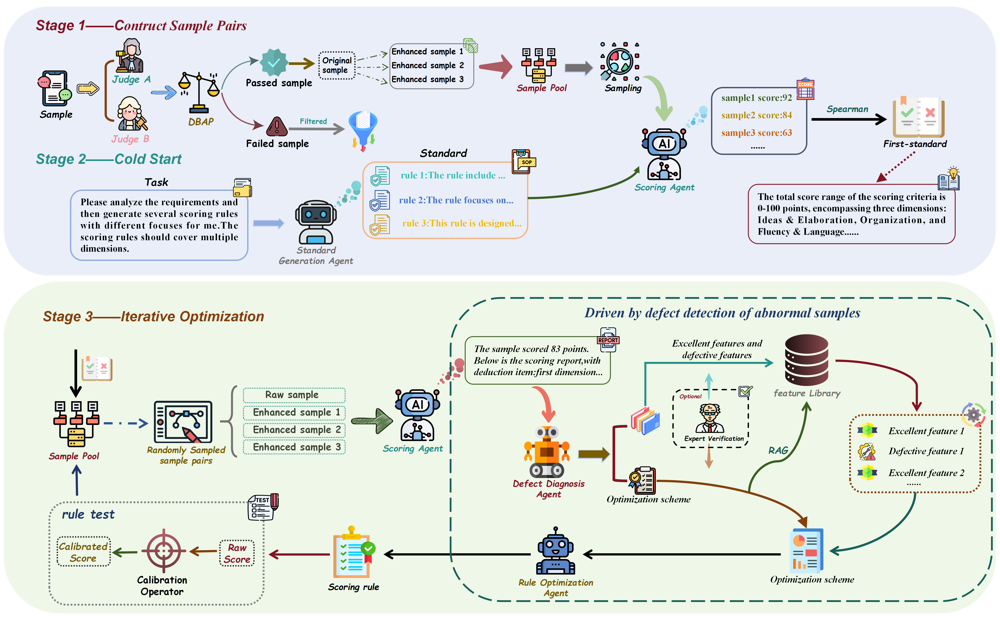

# DD-MARI: Defect-Driven Multi-Agent Rule Induction

[](https://arxiv.org/)
[](https://www.python.org/)
[](LICENSE)

Official implementation of the paper:

> **Beyond Black-Box Scoring: An Interpretable and Defect-Driven Few-Shot Rule Induction Framework for Document Quality Assessment**


---



---


DD-MARI addresses three black-box problems in automated Document Quality Assessment (DQA):


| Problem | Source  | DD-MARI Solution  |
|---|---|---|
| **Parameter Black-Box** | End-to-end neural models | Explicit natural-language scoring rules  |
| **Logical Black-Box** | Naive LLM self-refinement化 | Defect-driven multi-agent optimization |
| **Cognitive Black-Box** | Human–AI psychometric misalignment  | DBAP pre-screening + intra-loop Wasserstein calibration  |
---
---

## Quick Start

### 1. Clone and Install

```bash
git clone https://github.com/your-username/DD-MARI.git
cd DD-MARI
pip install -r requirements.txt
```

### 2. Configure API Key

```bash
cp .env.example .env
# Edit .env and set your LLM API key

```

The framework uses the [DeepSeek API](https://api.deepseek.com) by default (compatible with the OpenAI SDK).
Any OpenAI-compatible endpoint can be used by changing `LLM_BASE_URL` in `.env`.


### 3. Prepare Data 

Download the ASAP dataset from [Kaggle](https://www.kaggle.com/c/asap-aes/data) and place the files in `data/`:

 [Kaggle](https://www.kaggle.com/c/asap-aes/data)


#### Data Format

| Column  | Description |
|---|---|
| `essay_id` | Unique essay identifier |
| `essay` | Essay text (may contain `@CAPS1`, `@NUM1` etc. — privacy markers) |
| `domain1_score` | ASAP combined score, **2–12 scale** (sum of two raters × 1–6 each) |


#### Training Pool Construction

 `asap_set1_training.xlsx` file should have an additional column `sample_type`:

| `sample_type` value | Meaning |
|---|---|
| `gold` / `original` | High-quality anchor essay |
| `aug` / `augmented` / `negative` | Hard-negative variant (proximal score, ∆ ≤ δ) |

If `sample_type` is absent, the framework infers it from the `essay_id` string
(looks for keywords: `aug`， `enhanced`, `negative`, `neg`).


---

### 4. Run Training

```bash
# Full pipeline (cold start → iterative optimization)
python main.py

# Resume from checkpoint (useful after interruption)
python main.py --resume
```

Training output is saved to `output/`:

- `rule_history.json`  — all rule versions with their QWK scores 
- `final_rule.json`    — the best induced rule 
- `feature_library.json` — accumulated defect/quality features 

### 5. Evaluate 

```bash
# Evaluate the final rule on a test set

python main.py --eval --test_file data/asap_set1_test.xlsx --output output/result.xlsx
```

---

## Configuration 

| Parameter  | Default| Description |
|---|---|---|
| `SCORE_MIN / SCORE_MAX` | 2 / 12 | Scoring range  |
| `SCORE_MARGIN_THRESHOLD` (δ) | 2 | Max score gap for hard-negative pairs  |
| `NUM_INITIAL_RULES` (N) | 3 | Candidate rules generated by SGA  |
| `MAX_ITERATIONS` (K) | 30 | Maximum optimization rounds  |
| `ROLLBACK_THRESHOLD` (τ) | 0.001 | Min calibrated QWK gain to accept a new rule |
| `RAG_TOP_K` | 5 | Features retrieved per iteration |
| `DBAP_THRESHOLD` (τN) | 3.0 | Max |SA−SB| before essay is filtered by DBAP |
| `CALIB_ALPHA_GRID` | [0.3…2.0] | Grid search candidates for αi (Wasserstein calibration) |
| `CALIB_KAPPA` (κ) | 1.0 | Calibration amplitude |
| `CALIB_ALPHAS` | [0.5, 1.2] | Default αi (overridden by grid search each iteration) |
| `ITER_EVAL_SIZE` | 100 | \|Dcal\|: essays used for Phase 3 rollback |
| `HUMAN_IN_THE_LOOP` | `False` | Enable expert binary validation |

---

## Project Structure 

```
DD-MARI/
├── main.py                  # CLI entry point 
├── workflow.py              # Full DD-MARI pipeline (Algorithm 1) ）
├── agents.py                # Four LLM agents: SGA, SA, DDA, ROA
├── cognitive_alignment.py   # Phase 4: verbosity decoupling + calibration 
├── data_manager.py          # Data loading, anchor extraction, feature library 
├── evaluator.py             # QWK and auxiliary metrics 
├── data_models.py           # Data classes: Essay, ScoringRule, EvaluationRecord
├── config.py                # All configuration and hyperparameters
├── data/                    # Dataset directory (not tracked by git) 
│   ├── asap_set1_gradient.xlsx
│   ├── asap_set1_training.xlsx
│   ├── asap_set1_test.xlsx
│   └── Set1_standard.docx
├── output/                  # Generated output (not tracked by git) 
│   ├── rule_history.json
│   ├── final_rule.json
│   └── feature_library.json
├── requirements.txt
├── .env.example
└── README.md
```


## Web Demo

A fully functional scoring demo is available in [`score_demo/`](score_demo/).
It wraps the DD-MARI induced rule into a FastAPI + HTML/JS web interface.

```bash
cd score_demo
cp .env.example .env      # fill in your LLM API key
pip install fastapi uvicorn pydantic pydantic-settings
uvicorn app.main:app --reload --port 8000
# Open http://localhost:8000
```

### Demo Video

https://github.com/user-attachments/assets/6920bfda-f95d-46da-ad7f-70e47ad4d0d9

---

## Real-World Deployment / 实际落地应用

DD-MARI has been successfully deployed in a real-world industrial project with **China Southern Power Grid (南方电网)**, demonstrating its practical applicability beyond academic benchmarks.

DD-MARI 已成功落地至**南方电网**的实际工程项目中，验证了该框架在学术基准之外的工业可用性。

The following video demonstrates the deployed system in action (sensitive information has been desensitized / 以下演示视频已做脱敏处理):

https://github.com/user-attachments/assets/9d06b64e-fb5a-424e-b659-9666d51070f4

---

## License 

MIT License. See [LICENSE](LICENSE) for details.

